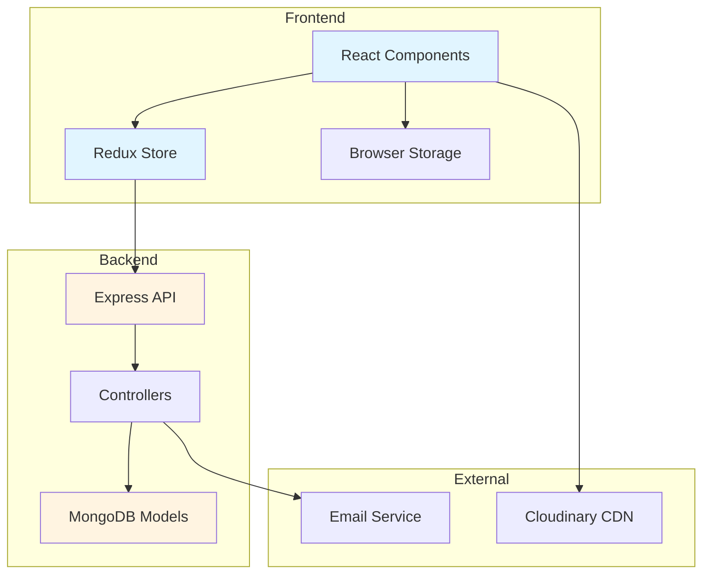

# Design Document: Advanced User Experience Features

## Overview

This design document specifies the technical implementation for five advanced user experience features for the RMNA Street e-commerce platform: Enhanced Product Filtering, Product Comparison, Size Guide Modal, Product Image Zoom, and Back in Stock Notifications.

### System Context

The RMNA Street platform is built on the MERN stack:
- **Frontend**: React 18 with Redux Toolkit for state management, React Router for navigation, Tailwind CSS for styling
- **Backend**: Node.js with Express.js REST API
- **Database**: MongoDB with Mongoose ODM
- **Additional Services**: Cloudinary for image storage, Brevo/Nodemailer for email notifications

### Feature Summary

1. **Enhanced Product Filtering**: Multi-criteria filtering with color swatches, brand checkboxes, and price range sliders
2. **Product Comparison**: Side-by-side comparison of up to 4 products with difference highlighting
3. **Size Guide Modal**: Category-specific measurement charts with unit conversion
4. **Product Image Zoom**: 2x magnification on hover for detailed product inspection
5. **Back in Stock Notifications**: Email alerts when out-of-stock products become available

### Design Goals

- Maintain consistency with existing RMNA Street UI/UX patterns
- Ensure responsive design across desktop, tablet, and mobile devices
- Optimize performance with efficient state management and API calls
- Provide accessible interfaces following WCAG guidelines
- Enable seamless integration with existing product, cart, and user systems

## Architecture

### High-Level Architecture



### Component Architecture

Each feature follows a modular architecture:

1. **Presentation Layer**: React components for UI rendering
2. **State Management Layer**: Redux slices for global state
3. **API Layer**: Express controllers and routes
4. **Data Layer**: Mongoose models and schemas
5. **Service Layer**: Utility functions for business logic

### Data Flow

**Filtering & Comparison** (Client-side heavy):
```
User Interaction → Component State → Redux Store → API Request → Database Query → Response → Redux Update → UI Re-render
```

**Stock Notifications** (Server-side heavy):
```
User Subscription → API Request → Database Write → Stock Update Event → Email Service → Notification Sent → Subscription Cleanup
```

## Components and Interfaces

### 1. Enhanced Product Filtering

#### Frontend Components

**FilterPanel Component** (`src/components/product/FilterPanel.jsx`)
- Renders all filter controls (color, brand, price range)
- Manages local filter state before applying
- Emits filter change events to parent

**ColorFilter Component** (`src/components/product/ColorFilter.jsx`)
- Displays color swatches as clickable buttons
- Supports single color selection
- Visual feedback for selected color

**BrandFilter Component** (`src/components/product/BrandFilter.jsx`)
- Displays brand checkboxes
- Supports multiple brand selection
- Shows brand names from product data

**PriceRangeFilter Component** (`src/components/product/PriceRangeFilter.jsx`)
- Dual-handle range slider
- Displays current min/max values
- Debounced updates to prevent excessive API calls

#### Redux State

**productSlice** (extend existing `src/store/slices/productSlice.js`)
```javascript
{
  filters: {
    colors: [],
    brands: [],
    priceRange: { min: 0, max: 10000 },
    // existing filters: size, fitType, category, etc.
  },
  filteredProducts: [],
  filterCount: 0,
  availableColors: [],
  availableBrands: []
}
```

#### Backend API

**Extended Product Model** (`backend/models/Product.js`)
```javascript
{
  // existing fields...
  color: { type: String, required: true },
  brand: { type: String, required: true }
}
```

**API Endpoints** (extend `backend/controllers/productController.js`)
- `GET /api/products?color=red&brand=Nike,Adidas&minPrice=500&maxPrice=2000`
- Returns filtered products with total count
- Supports combining multiple filter criteria

**Filter Metadata Endpoint**
- `GET /api/products/filters` - Returns available colors and brands for current category

### 2. Product Comparison

#### Frontend Components

**ComparisonBar Component** (`src/components/product/ComparisonBar.jsx`)
- Floating bar at bottom of screen
- Shows count of selected products
- "Compare" button to open comparison view
- Visible only when products are selected

**ComparisonView Component** (`src/components/product/ComparisonView.jsx`)
- Full-screen modal overlay
- Side-by-side product cards in grid layout
- Scrollable on mobile devices
- Close button and remove product buttons

**ProductComparisonCard Component** (`src/components/product/ProductComparisonCard.jsx`)
- Displays single product in comparison view
- Shows: image, name, price, sizes, colors, fit type, rating
- "Add to Cart" button
- "Remove" button

**CompareButton Component** (`src/components/product/CompareButton.jsx`)
- Toggle button on product cards
- Visual indicator when product is selected
- Disabled when 4 products already selected

#### Redux State

**comparisonSlice** (new `src/store/slices/comparisonSlice.js`)
```javascript
{
  selectedProducts: [], // Array of product IDs (max 4)
  products: {}, // Map of product ID to product data
  isComparisonViewOpen: false,
  differences: {} // Map of field names to boolean (has difference)
}
```

#### Local Storage

Persist comparison selections:
```javascript
localStorage.setItem('rmna_comparison', JSON.stringify(selectedProductIds))
```

#### Comparison Logic

**Difference Detection Algorithm**:
```javascript
function detectDifferences(products) {
  const fields = ['price', 'sizes', 'colors', 'fitType', 'rating'];
  const differences = {};
  
  fields.forEach(field => {
    const values = products.map(p => p[field]);
    const uniqueValues = new Set(values.map(v => JSON.stringify(v)));
    differences[field] = uniqueValues.size > 1;
  });
  
  return differences;
}
```

### 3. Size Guide Modal

#### Frontend Components

**SizeGuideButton Component** (`src/components/product/SizeGuideButton.jsx`)
- Button displayed on product detail page
- Only visible for clothing categories (not accessories)
- Opens size guide modal on click

**SizeGuideModal Component** (`src/components/product/SizeGuideModal.jsx`)
- Modal overlay with size chart table
- Unit toggle (cm/inches)
- Category-specific charts
- Keyboard accessible (ESC to close, tab navigation)

**SizeChart Component** (`src/components/product/SizeChart.jsx`)
- Renders measurement table
- Columns: Size, Chest, Waist, Hip, Length
- Responsive table layout

#### Size Guide Data Structure

**Product Model Extension** (`backend/models/Product.js`)
```javascript
{
  sizeGuide: {
    category: String, // 'mens-shirts', 'womens-jeans', 'girls-kurti', 'girls-jeans'
    measurements: [
      {
        size: String,
        chest: Number, // in cm
        waist: Number,
        hip: Number,
        length: Number
      }
    ]
  }
}
```

**Size Guide Templates** (Frontend constants)
```javascript
const SIZE_GUIDE_TEMPLATES = {
  'mens-shirts': {
    dimensions: ['chest', 'waist', 'length'],
    sizes: ['S', 'M', 'L', 'XL', 'XXL']
  },
  'womens-jeans': {
    dimensions: ['waist', 'hip', 'length'],
    sizes: ['26', '28', '30', '32', '34', '36']
  },
  'girls-kurti': {
    dimensions: ['chest', 'waist', 'length'],
    sizes: ['S', 'M', 'L', 'XL']
  },
  'girls-jeans': {
    dimensions: ['waist', 'hip', 'length'],
    sizes: ['26', '28', '30', '32', '34']
  }
};
```

#### Unit Conversion

```javascript
function convertToInches(cm) {
  return (cm / 2.54).toFixed(1);
}

function convertToCm(inches) {
  return (inches * 2.54).toFixed(1);
}
```

### 4. Product Image Zoom

#### Frontend Components

**ImageZoom Component** (`src/components/product/ImageZoom.jsx`)
- Wraps product images on detail page
- Tracks mouse position
- Renders zoom lens overlay
- Loads high-resolution images

**ZoomLens Component** (`src/components/product/ZoomLens.jsx`)
- Separate overlay showing magnified view
- Positioned adjacent to main image
- 2x magnification
- Smooth transitions

#### Zoom Implementation

**Mouse Tracking**:
```javascript
function handleMouseMove(e) {
  const rect = imageRef.current.getBoundingClientRect();
  const x = e.clientX - rect.left;
  const y = e.clientY - rect.top;
  
  // Calculate zoom lens position
  const lensX = x - (lensWidth / 2);
  const lensY = y - (lensHeight / 2);
  
  // Calculate magnified image offset
  const bgX = x * zoomLevel;
  const bgY = y * zoomLevel;
  
  setZoomPosition({ lensX, lensY, bgX, bgY });
}
```

**Device Detection**:
```javascript
function isMobileOrTablet() {
  return /Android|webOS|iPhone|iPad|iPod|BlackBerry|IEMobile|Opera Mini/i.test(navigator.userAgent)
    || window.innerWidth < 1024;
}
```

**Image Loading Strategy**:
- Standard images: Cloudinary transformation `w_800,h_1066,q_auto`
- Zoom images: Cloudinary transformation `w_1600,h_2132,q_90`
- Lazy load zoom images on first hover

### 5. Back in Stock Notifications

#### Frontend Components

**NotifyMeButton Component** (`src/components/product/NotifyMeButton.jsx`)
- Displayed when product totalStock === 0
- Opens email input modal
- Shows subscription status

**StockNotificationModal Component** (`src/components/product/StockNotificationModal.jsx`)
- Email input form
- Pre-fills email for logged-in users
- Validation feedback
- Success/error messages

#### Backend Components

**NotificationSubscription Model** (new `backend/models/NotificationSubscription.js`)
```javascript
{
  product: { type: ObjectId, ref: 'Product', required: true },
  email: { type: String, required: true, lowercase: true, trim: true },
  createdAt: { type: Date, default: Date.now },
  notified: { type: Boolean, default: false }
}

// Compound index to prevent duplicate subscriptions
notificationSubscriptionSchema.index({ product: 1, email: 1 }, { unique: true });
```

**Notification Controller** (new `backend/controllers/notificationController.js`)
- `POST /api/notifications/subscribe` - Create subscription
- `POST /api/notifications/check-subscription` - Check if user is subscribed
- Internal: `triggerStockNotifications(productId)` - Send emails when stock updated

#### Email Template

**Back in Stock Email** (`backend/utils/emailTemplates.js`)
```javascript
function backInStockEmail(product, userEmail) {
  return {
    to: userEmail,
    subject: `${product.name} is back in stock!`,
    html: `
      <h2>Good news! ${product.name} is back in stock</h2>
      
      <p>Price: ₹${product.price}</p>
      <a href="${process.env.FRONTEND_URL}/products/${product._id}">View Product</a>
    `
  };
}
```

#### Stock Update Hook

**Product Controller Extension** (`backend/controllers/productController.js`)
```javascript
// In updateProduct function
const oldStock = product.totalStock;
// ... update product ...
const newStock = product.totalStock;

if (oldStock === 0 && newStock > 0) {
  // Trigger notifications asynchronously
  triggerStockNotifications(product._id).catch(console.error);
}
```

## Data Models

### Extended Product Model

```javascript
const productSchema = new mongoose.Schema({
  // Existing fields
  name: { type: String, required: true, trim: true },
  description: { type: String, required: true },
  price: { type: Number, required: true, min: 0 },
  discountPrice: { type: Number, default: 0 },
  images: [{ public_id: String, url: String }],
  category: { type: String, default: 'jeans' },
  subcategory: { type: String },
  fitType: { type: String, enum: ['straight', 'baggy', 'slim', 'regular'] },
  sizes: [{
    size: { type: String },
    stock: { type: Number, default: 0 }
  }],
  totalStock: { type: Number, default: 0 },
  tags: [String],
  isFeatured: { type: Boolean, default: false },
  isActive: { type: Boolean, default: true },
  reviews: [reviewSchema],
  numReviews: { type: Number, default: 0 },
  rating: { type: Number, default: 0 },
  
  // NEW FIELDS
  color: { 
    type: String, 
    required: true,
    enum: ['black', 'white', 'blue', 'red', 'green', 'yellow', 'pink', 'purple', 'gray', 'brown', 'beige', 'navy', 'maroon', 'olive', 'orange']
  },
  brand: { 
    type: String, 
    required: true,
    trim: true
  },
  sizeGuide: {
    category: { 
      type: String,
      enum: ['mens-shirts', 'womens-jeans', 'girls-kurti', 'girls-jeans', 'womens-accessories']
    },
    measurements: [{
      size: String,
      chest: Number,
      waist: Number,
      hip: Number,
      length: Number
    }]
  },
  highResImages: [{ 
    public_id: String, 
    url: String 
  }] // For zoom functionality
}, { timestamps: true });

// Add indexes for filtering
productSchema.index({ color: 1 });
productSchema.index({ brand: 1 });
productSchema.index({ price: 1 });
productSchema.index({ color: 1, brand: 1, price: 1 }); // Compound index for multi-filter queries
```

### NotificationSubscription Model

```javascript
const notificationSubscriptionSchema = new mongoose.Schema({
  product: { 
    type: mongoose.Schema.Types.ObjectId, 
    ref: 'Product', 
    required: true 
  },
  email: { 
    type: String, 
    required: true,
    lowercase: true,
    trim: true,
    match: /^[^\s@]+@[^\s@]+\.[^\s@]+$/ // Email validation regex
  },
  createdAt: { 
    type: Date, 
    default: Date.now,
    expires: 2592000 // Auto-delete after 30 days if not notified
  },
  notified: { 
    type: Boolean, 
    default: false 
  }
}, { timestamps: true });

// Compound unique index to prevent duplicate subscriptions
notificationSubscriptionSchema.index(
  { product: 1, email: 1 }, 
  { unique: true }
);

// Index for efficient queries
notificationSubscriptionSchema.index({ product: 1, notified: 1 });
```

## Correctness Properties

*A property is a characteristic or behavior that should hold true across all valid executions of a system—essentially, a formal statement about what the system should do. Properties serve as the bridge between human-readable specifications and machine-verifiable correctness guarantees.*

### Property 1: Combined Filter Correctness

*For any* combination of color, brand, and price range filters applied to a product list, all returned products SHALL match ALL selected filter criteria simultaneously.

**Validates: Requirements 1.4, 1.5, 1.6, 1.7, 1.11**

### Property 2: Filter Count Accuracy

*For any* filter state (color, brand, price range), the displayed product count SHALL equal the actual number of products matching the filter criteria.

**Validates: Requirements 1.8**

### Property 3: Filter Reset Completeness

*For any* filter state with one or more filters applied, clearing all filters SHALL restore the product list to show all available products and reset all filter selections to their default state.

**Validates: Requirements 1.9**

### Property 4: Comparison Limit Enforcement

*For any* sequence of product selections, the comparison system SHALL accept up to 4 products and SHALL reject any attempt to add a 5th product with an appropriate error message.

**Validates: Requirements 2.1, 2.10**

### Property 5: Comparison Count Accuracy

*For any* number of products selected for comparison (0 to 4), the displayed count in the comparison bar SHALL equal the actual number of selected products.

**Validates: Requirements 2.3**

### Property 6: Comparison View Completeness

*For any* set of products in the comparison view, the rendered output SHALL include all required fields (image, name, price, sizes, colors, fit type, rating) for each product.

**Validates: Requirements 2.5**

### Property 7: Comparison Difference Detection

*For any* set of 2 or more products being compared, fields with different values across products SHALL be marked as different, and fields with identical values SHALL not be marked as different.

**Validates: Requirements 2.6**

### Property 8: Comparison Removal Correctness

*For any* comparison state with selected products, removing a product SHALL update the comparison view to exclude that product and update the selection count accordingly.

**Validates: Requirements 2.7**

### Property 9: Comparison Persistence

*For any* comparison state with selected products, the selection SHALL persist in browser storage and SHALL be restored after page navigation or browser refresh.

**Validates: Requirements 2.9**

### Property 10: Size Guide Display Correctness

*For any* product category (mens-shirts, womens-jeans, girls-kurti, girls-jeans), the size guide modal SHALL display the correct measurement chart with all applicable dimensions (chest, waist, hip, length) for that category.

**Validates: Requirements 3.3, 3.4, 3.5**

### Property 11: Unit Conversion Accuracy

*For any* measurement value in the size guide, converting from centimeters to inches and back to centimeters SHALL preserve the original value within acceptable rounding tolerance (±0.1 cm).

**Validates: Requirements 3.6**

### Property 12: Image Zoom Behavior Correctness

*For any* cursor position within the image boundaries, the zoom component SHALL display a magnified view at exactly 2x zoom level showing the correct image area corresponding to the cursor position, and SHALL follow cursor movement smoothly.

**Validates: Requirements 4.1, 4.2, 4.3**

### Property 13: Zoom Boundary Behavior

*For any* cursor position outside the image boundaries, the zoom component SHALL hide the magnified view.

**Validates: Requirements 4.4**

### Property 14: High-Resolution Image Loading

*For any* product image with zoom functionality enabled, the zoom component SHALL load and display the high-resolution version of the image.

**Validates: Requirements 4.6**

### Property 15: Subscription Creation and Duplicate Handling

*For any* valid email address and out-of-stock product, the system SHALL create a notification subscription if one does not exist, and SHALL display an "already subscribed" message if a subscription already exists for that email-product combination.

**Validates: Requirements 5.3, 5.12**

### Property 16: Email Validation Correctness

*For any* input string, the email validation function SHALL correctly identify valid email addresses (containing @ and domain) and reject invalid formats.

**Validates: Requirements 5.4**

### Property 17: Stock Notification Trigger Correctness

*For any* product with notification subscriptions, when the stock quantity changes from 0 to greater than 0, the system SHALL send email notifications to all subscribed users for that product.

**Validates: Requirements 5.7**

### Property 18: Notification Email Completeness

*For any* back-in-stock notification email sent, the email content SHALL include the product name, product image, product price, and a direct link to the product detail page.

**Validates: Requirements 5.8**

### Property 19: Subscription Cleanup After Notification

*For any* notification subscription, after the back-in-stock email is successfully sent, the subscription record SHALL be removed from the database.

**Validates: Requirements 5.9**

## Error Handling

### Frontend Error Handling

**Filter Errors**:
- API timeout: Display "Unable to load products. Please try again."
- Invalid filter combination: Reset to last valid state
- Network error: Show retry button

**Comparison Errors**:
- Exceeding 4 products: Toast notification "Maximum 4 products can be compared"
- Product data fetch failure: Remove failed product from comparison
- Storage quota exceeded: Clear old comparison data

**Size Guide Errors**:
- Missing size guide data: Display "Size guide not available for this product"
- Invalid category: Fall back to generic size chart

**Image Zoom Errors**:
- High-res image load failure: Continue using standard resolution
- Performance issues: Disable zoom on slow devices

**Stock Notification Errors**:
- Invalid email: Display inline validation error "Please enter a valid email address"
- Subscription failure: Display "Unable to subscribe. Please try again later."
- Already subscribed: Display "You're already subscribed to notifications for this product"
- Network error: Show retry button

### Backend Error Handling

**Product Filtering**:
```javascript
try {
  const products = await Product.find(query).sort(sortBy);
  res.json({ success: true, products, total });
} catch (error) {
  res.status(500).json({ 
    success: false, 
    message: 'Error fetching products',
    error: process.env.NODE_ENV === 'development' ? error.message : undefined
  });
}
```

**Notification Subscription**:
```javascript
try {
  const subscription = await NotificationSubscription.create({ product, email });
  res.json({ success: true, message: 'Subscription created' });
} catch (error) {
  if (error.code === 11000) { // Duplicate key error
    res.status(400).json({ 
      success: false, 
      message: 'You are already subscribed to this product' 
    });
  } else {
    res.status(500).json({ 
      success: false, 
      message: 'Error creating subscription' 
    });
  }
}
```

**Email Sending**:
```javascript
async function sendStockNotification(subscription) {
  try {
    await sendEmail(backInStockEmail(product, subscription.email));
    await NotificationSubscription.findByIdAndDelete(subscription._id);
  } catch (error) {
    console.error(`Failed to send notification to ${subscription.email}:`, error);
    // Don't delete subscription if email fails - retry later
  }
}
```

### Error Logging

- Frontend: Log errors to console in development, send to monitoring service in production
- Backend: Use Morgan for HTTP logging, Winston for application logging
- Critical errors (email failures, database errors): Alert admin via monitoring service

## Testing Strategy

### Unit Testing

**Frontend Components** (React Testing Library + Vitest):
- Filter components: Render correctly, emit events on interaction
- Comparison components: Selection logic, UI updates, storage operations
- Size guide: Modal open/close, unit conversion, table rendering
- Image zoom: Mouse tracking, zoom calculations, device detection
- Notification components: Form validation, submission handling

**Backend Controllers** (Jest + Supertest):
- Product filtering: Query building, response formatting
- Notification subscription: Creation, duplicate detection, validation
- Email sending: Template generation, error handling

**Redux Slices** (Redux Toolkit Testing):
- Filter state management: Action creators, reducers, selectors
- Comparison state: Selection logic, persistence
- Async thunks: API calls, error handling

### Property-Based Testing

**Testing Library**: fast-check (JavaScript property-based testing library)

**Configuration**: Minimum 100 iterations per property test

**Property Test Implementation**:

Each correctness property will be implemented as a property-based test with the following tag format:
```javascript
// Feature: advanced-user-experience-features, Property 1: Combined Filter Correctness
```

**Example Property Test Structure**:
```javascript
import fc from 'fast-check';

describe('Property 1: Combined Filter Correctness', () => {
  it('filters products correctly for any combination of criteria', () => {
    fc.assert(
      fc.property(
        fc.array(productArbitrary), // Generate random product list
        fc.record({ // Generate random filter criteria
          color: fc.option(fc.constantFrom('red', 'blue', 'green')),
          brands: fc.array(fc.constantFrom('Nike', 'Adidas', 'Puma')),
          priceRange: fc.record({
            min: fc.nat(5000),
            max: fc.nat(5000).map(n => n + 5000)
          })
        }),
        (products, filters) => {
          const filtered = applyFilters(products, filters);
          // Verify all returned products match ALL filter criteria
          return filtered.every(product => matchesFilters(product, filters));
        }
      ),
      { numRuns: 100 }
    );
  });
});
```

**Generators (Arbitraries)**:
- Product generator: Random products with varying colors, brands, prices
- Filter generator: Random filter combinations
- Email generator: Valid and invalid email formats
- Cursor position generator: Random coordinates within/outside image bounds
- Measurement generator: Random size measurements for conversion testing

### Integration Testing

**API Integration** (Supertest):
- Filter endpoint: Test with various query parameter combinations
- Notification endpoints: Test subscription creation, duplicate handling
- Stock update flow: Test notification triggering on stock change

**Database Integration** (MongoDB Memory Server):
- Product queries with filters and indexes
- Notification subscription uniqueness constraint
- Subscription cleanup after notification

**Email Integration** (Mock SMTP server):
- Email template rendering
- Notification sending on stock update
- Error handling for failed sends

### End-to-End Testing

**User Flows** (Playwright or Cypress):
- Complete filtering workflow: Select filters → View results → Clear filters
- Complete comparison workflow: Select products → Compare → Add to cart
- Complete notification workflow: Subscribe → Stock update → Receive email
- Size guide workflow: Open modal → Toggle units → Close modal
- Image zoom workflow: Hover → Zoom → Move cursor → Exit

### Performance Testing

**Frontend Performance**:
- Filter updates: Should complete within 100ms
- Comparison view rendering: Should render 4 products within 200ms
- Image zoom: Should track cursor at 60fps
- Bundle size: Monitor impact of new components on bundle size

**Backend Performance**:
- Filtered product queries: Should complete within 200ms for 1000+ products
- Notification batch sending: Should handle 100+ subscriptions efficiently
- Database indexes: Verify query performance with EXPLAIN

### Accessibility Testing

**Manual Testing**:
- Keyboard navigation: All interactive elements accessible via keyboard
- Screen reader: Proper ARIA labels and announcements
- Color contrast: Ensure sufficient contrast for color swatches and text
- Focus management: Proper focus trapping in modals

**Automated Testing** (axe-core):
- Run accessibility audits on all new components
- Verify WCAG 2.1 Level AA compliance

### Browser Compatibility Testing

**Target Browsers**:
- Chrome (latest 2 versions)
- Firefox (latest 2 versions)
- Safari (latest 2 versions)
- Edge (latest 2 versions)
- Mobile Safari (iOS 14+)
- Chrome Mobile (Android 10+)

**Specific Tests**:
- Image zoom: Verify disabled on mobile/tablet
- Range sliders: Test native input support
- Local storage: Test persistence across browsers

