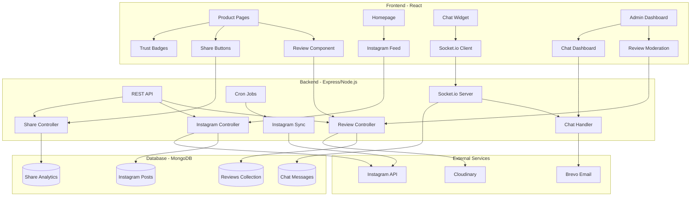

# Social & Trust Features - Design Document

## Overview

This design document outlines the technical implementation for social proof and trust-building features for the RMNA Street e-commerce platform. The features include enhanced customer reviews with photo uploads, Instagram feed integration, social sharing capabilities, trust badges, and live chat support.

### Goals

- Increase conversion rate by 15-25% through social proof mechanisms
- Build customer trust with verified reviews and trust signals
- Enable real-time customer support through live chat
- Integrate social media presence directly into the platform
- Provide comprehensive analytics for business insights

### Scope

This design covers:
- Enhanced review system with photo uploads and multi-criteria ratings
- Instagram feed integration using Instagram Basic Display API
- Social sharing with tracking and analytics
- Trust badge system with policy pages
- Real-time chat system using Socket.io
- Admin dashboards for moderation and analytics

---

## Architecture

### System Architecture



### Technology Stack

**Backend:**
- Node.js + Express.js (existing)
- Socket.io for real-time chat
- MongoDB with Mongoose ODM
- Multer for file uploads
- Node-cron for scheduled tasks

**Frontend:**
- React 18 with hooks
- Redux Toolkit for state management
- Socket.io-client for real-time features
- Tailwind CSS for styling
- React Query for data fetching

**External Services:**
- Cloudinary for image storage and optimization
- Instagram Basic Display API for feed integration
- Brevo for email notifications
- Optional: Content moderation API for review photos

**Infrastructure:**
- WebSocket connections for chat
- Cron jobs for Instagram sync
- Redis (optional) for Socket.io scaling

---

## Components and Interfaces

### 1. Enhanced Review System

#### Frontend Components

**ReviewForm Component**
```jsx
<ReviewForm 
  productId={string}
  orderId={string}
  onSubmit={function}
  maxPhotos={5}
  maxPhotoSize={5MB}
/>
```

Props:
- `productId`: Product being reviewed
- `orderId`: Order ID for verification
- `onSubmit`: Callback after successful submission
- `maxPhotos`: Maximum number of photos (default: 5)
- `maxPhotoSize`: Maximum file size per photo (default: 5MB)

State:
- `rating`: Overall rating (1-5)
- `comment`: Review text
- `photos`: Array of File objects
- `sizePurchased`: Selected size
- `fitRating`: Fit assessment
- `qualityRating`: Quality rating (1-5)
- `valueRating`: Value rating (1-5)
- `uploading`: Upload progress state

**ReviewList Component**
```jsx
<ReviewList
  productId={string}
  reviews={array}
  averageRating={number}
  ratingDistribution={object}
  onHelpful={function}
  onReport={function}
/>
```

**ReviewCard Component**
```jsx
<ReviewCard
  review={object}
  onHelpful={function}
  onReport={function}
  showAdminActions={boolean}
/>
```

**PhotoGallery Component**
```jsx
<PhotoGallery
  photos={array}
  onPhotoClick={function}
/>
```

#### Backend API Endpoints

**POST /api/reviews/:productId**
- Create new review with photos
- Requires authentication
- Validates purchase verification
- Uploads photos to Cloudinary
- Returns created review

Request Body:
```json
{
  "rating": 5,
  "comment": "Great product!",
  "photos": ["base64_image_1", "base64_image_2"],
  "sizePurchased": "32",
  "fitRating": "perfect",
  "qualityRating": 5,
  "valueRating": 4
}
```

**GET /api/reviews/:productId**
- Get all reviews for a product
- Supports pagination and filtering
- Returns aggregated statistics

Query Parameters:
- `page`: Page number (default: 1)
- `limit`: Items per page (default: 10)
- `rating`: Filter by rating
- `sort`: Sort order (helpful, recent, rating)

Response:
```json
{
  "reviews": [],
  "pagination": {
    "page": 1,
    "pages": 5,
    "total": 47
  },
  "statistics": {
    "averageRating": 4.5,
    "totalReviews": 47,
    "ratingDistribution": {
      "5": 25,
      "4": 15,
      "3": 5,
      "2": 1,
      "1": 1
    },
    "verifiedPurchases": 45,
    "withPhotos": 20
  }
}
```

**PUT /api/reviews/:reviewId/helpful**
- Mark review as helpful
- Increments helpful count
- Tracks user votes (prevent duplicates)

**POST /api/reviews/:reviewId/report**
- Report inappropriate review
- Requires reason
- Notifies admin

**Admin Endpoints:**

**GET /api/admin/reviews/pending**
- Get reviews pending moderation
- Paginated list

**PUT /api/admin/reviews/:reviewId/approve**
- Approve pending review
- Sends email notification to reviewer

**PUT /api/admin/reviews/:reviewId/reject**
- Reject review with reason
- Sends email notification

**POST /api/admin/reviews/:reviewId/respond**
- Admin response to review
- Publicly visible

**DELETE /api/admin/reviews/:reviewId**
- Delete review (spam/inappropriate)

### 2. Instagram Feed Integration

#### Frontend Components

**InstagramFeed Component**
```jsx
<InstagramFeed
  posts={array}
  columns={4}
  showCaption={boolean}
  onPostClick={function}
/>
```

**InstagramPost Component**
```jsx
<InstagramPost
  post={object}
  showStats={boolean}
/>
```

Props:
- `post`: Instagram post data
- `showStats`: Show likes/comments count

#### Backend API Endpoints

**GET /api/instagram/feed**
- Get cached Instagram posts
- Returns latest posts from database

Response:
```json
{
  "posts": [
    {
      "id": "instagram_post_id",
      "caption": "Check out our new collection!",
      "mediaUrl": "https://...",
      "mediaType": "IMAGE",
      "permalink": "https://instagram.com/p/...",
      "timestamp": "2025-01-15T10:00:00Z",
      "likeCount": 150,
      "commentsCount": 25
    }
  ],
  "lastSync": "2025-01-15T12:00:00Z",
  "profileUrl": "https://instagram.com/rmnastreet"
}
```

**POST /api/admin/instagram/sync**
- Manually trigger Instagram sync
- Admin only
- Fetches latest posts from Instagram API

**POST /api/admin/instagram/connect**
- Connect Instagram account
- OAuth flow
- Stores access token securely

**GET /api/admin/instagram/status**
- Check Instagram connection status
- Returns token validity and last sync time

### 3. Social Sharing

#### Frontend Components

**ShareButtons Component**
```jsx
<ShareButtons
  product={object}
  type="product"
  position="detail"
/>
```

Props:
- `product`: Product data for sharing
- `type`: Content type (product, wishlist, order)
- `position`: Button placement (detail, card, wishlist)

Platforms:
- WhatsApp
- Facebook
- Twitter
- Copy Link

**ShareModal Component**
```jsx
<ShareModal
  isOpen={boolean}
  onClose={function}
  shareUrl={string}
  shareData={object}
/>
```

#### Backend API Endpoints

**POST /api/share/track**
- Track share event
- Records platform, product, user

Request Body:
```json
{
  "productId": "product_id",
  "platform": "whatsapp",
  "type": "product"
}
```

**GET /api/admin/analytics/shares**
- Get share analytics
- Aggregated by platform, product, time

Query Parameters:
- `startDate`: Start date
- `endDate`: End date
- `groupBy`: Group by (platform, product, day)

Response:
```json
{
  "totalShares": 1250,
  "byPlatform": {
    "whatsapp": 650,
    "facebook": 350,
    "twitter": 150,
    "copyLink": 100
  },
  "topProducts": [
    {
      "productId": "...",
      "productName": "...",
      "shares": 85
    }
  ],
  "conversions": {
    "fromShares": 45,
    "conversionRate": 3.6
  }
}
```

### 4. Trust Badges

#### Frontend Components

**TrustBadges Component**
```jsx
<TrustBadges
  badges={array}
  layout="horizontal"
  size="medium"
/>
```

Badges:
- Secure Payment (SSL)
- Free Shipping
- Easy Returns
- Cash on Delivery
- 100% Authentic
- 24/7 Support

**TrustBadge Component**
```jsx
<TrustBadge
  icon={component}
  title={string}
  description={string}
  link={string}
/>
```

**PolicyPages Component**
- Shipping Policy
- Return & Refund Policy
- Privacy Policy
- Terms & Conditions

### 5. Live Chat System

#### Frontend Components

**ChatWidget Component**
```jsx
<ChatWidget
  position="bottom-right"
  theme="light"
  offlineMessage={string}
/>
```

State:
- `isOpen`: Widget open/closed
- `isOnline`: Admin availability
- `unreadCount`: Unread messages
- `messages`: Chat history
- `typing`: Typing indicator

**ChatWindow Component**
```jsx
<ChatWindow
  messages={array}
  onSendMessage={function}
  onClose={function}
  isTyping={boolean}
/>
```

**PreChatForm Component**
```jsx
<PreChatForm
  onSubmit={function}
  fields={array}
/>
```

Fields:
- Name (required)
- Email (required)
- Order Number (optional)
- Category (dropdown)
- Initial Message

**AdminChatDashboard Component**
```jsx
<AdminChatDashboard
  activeChats={array}
  queuedChats={array}
  onSelectChat={function}
  onAssignChat={function}
/>
```

**ChatConversation Component**
```jsx
<ChatConversation
  chat={object}
  messages={array}
  customerInfo={object}
  onSendMessage={function}
  cannedResponses={array}
/>
```

#### Backend API Endpoints

**REST Endpoints:**

**POST /api/chat/session**
- Create new chat session
- Requires pre-chat form data

Request Body:
```json
{
  "name": "John Doe",
  "email": "john@example.com",
  "orderNumber": "ORD123",
  "category": "product",
  "initialMessage": "I have a question about sizing"
}
```

Response:
```json
{
  "sessionId": "chat_session_id",
  "status": "queued",
  "estimatedWaitTime": 120
}
```

**GET /api/chat/history/:sessionId**
- Get chat history
- Requires authentication or session token

**POST /api/chat/transcript**
- Email chat transcript
- Sends to customer email

**GET /api/admin/chat/active**
- Get all active chat sessions
- Admin only

**PUT /api/admin/chat/:sessionId/assign**
- Assign chat to agent
- Admin only

**Socket.io Events:**

**Client → Server:**
- `join_chat`: Join chat session
- `send_message`: Send message
- `typing`: Typing indicator
- `read_message`: Mark message as read
- `upload_file`: Upload file/image

**Server → Client:**
- `message_received`: New message
- `agent_joined`: Agent joined chat
- `agent_typing`: Agent typing
- `chat_assigned`: Chat assigned to agent
- `chat_ended`: Chat session ended
- `queue_position`: Position in queue

---

## Data Models

### Review Model

```javascript
const reviewSchema = new mongoose.Schema({
  product: {
    type: mongoose.Schema.Types.ObjectId,
    ref: 'Product',
    required: true,
    index: true
  },
  user: {
    type: mongoose.Schema.Types.ObjectId,
    ref: 'User',
    required: true
  },
  order: {
    type: mongoose.Schema.Types.ObjectId,
    ref: 'Order',
    required: true
  },
  
  // Review Content
  rating: {
    type: Number,
    required: true,
    min: 1,
    max: 5
  },
  comment: {
    type: String,
    required: true,
    minlength: 50,
    maxlength: 500
  },
  
  // Photos
  photos: [{
    public_id: String,
    url: String,
    thumbnail: String
  }],
  
  // Additional Ratings
  sizePurchased: String,
  fitRating: {
    type: String,
    enum: ['too-small', 'perfect', 'too-large']
  },
  qualityRating: {
    type: Number,
    min: 1,
    max: 5
  },
  valueRating: {
    type: Number,
    min: 1,
    max: 5
  },
  
  // Verification & Moderation
  verifiedPurchase: {
    type: Boolean,
    default: true
  },
  status: {
    type: String,
    enum: ['pending', 'approved', 'rejected'],
    default: 'pending'
  },
  moderationNote: String,
  
  // Engagement
  helpfulCount: {
    type: Number,
    default: 0
  },
  helpfulVotes: [{
    user: mongoose.Schema.Types.ObjectId,
    votedAt: Date
  }],
  reportCount: {
    type: Number,
    default: 0
  },
  reports: [{
    user: mongoose.Schema.Types.ObjectId,
    reason: String,
    reportedAt: Date
  }],
  
  // Admin Response
  adminResponse: {
    text: String,
    respondedBy: mongoose.Schema.Types.ObjectId,
    respondedAt: Date
  },
  
  // Featured
  isFeatured: {
    type: Boolean,
    default: false
  }
}, {
  timestamps: true
});

// Indexes
reviewSchema.index({ product: 1, status: 1 });
reviewSchema.index({ user: 1 });
reviewSchema.index({ status: 1, createdAt: -1 });
reviewSchema.index({ helpfulCount: -1 });

module.exports = mongoose.model('Review', reviewSchema);
```

### Instagram Post Model

```javascript
const instagramPostSchema = new mongoose.Schema({
  instagramId: {
    type: String,
    required: true,
    unique: true,
    index: true
  },
  caption: String,
  mediaUrl: {
    type: String,
    required: true
  },
  mediaType: {
    type: String,
    enum: ['IMAGE', 'VIDEO', 'CAROUSEL_ALBUM'],
    required: true
  },
  permalink: {
    type: String,
    required: true
  },
  timestamp: {
    type: Date,
    required: true
  },
  
  // Engagement Stats
  likeCount: Number,
  commentsCount: Number,
  
  // Display Settings
  isActive: {
    type: Boolean,
    default: true
  },
  displayOrder: Number,
  
  // Sync Info
  lastSynced: {
    type: Date,
    default: Date.now
  }
}, {
  timestamps: true
});

// Index for sorting
instagramPostSchema.index({ timestamp: -1 });
instagramPostSchema.index({ isActive: 1, displayOrder: 1 });

module.exports = mongoose.model('InstagramPost', instagramPostSchema);
```

### Instagram Config Model

```javascript
const instagramConfigSchema = new mongoose.Schema({
  accessToken: {
    type: String,
    required: true
  },
  userId: {
    type: String,
    required: true
  },
  username: String,
  tokenExpiry: Date,
  
  // Settings
  postsToDisplay: {
    type: Number,
    default: 12
  },
  syncInterval: {
    type: Number,
    default: 6 // hours
  },
  isEnabled: {
    type: Boolean,
    default: true
  },
  
  // Sync Status
  lastSync: Date,
  lastSyncStatus: {
    type: String,
    enum: ['success', 'failed', 'pending']
  },
  lastSyncError: String,
  
  // Rate Limiting
  apiCallsToday: {
    type: Number,
    default: 0
  },
  apiCallsResetAt: Date
}, {
  timestamps: true
});

module.exports = mongoose.model('InstagramConfig', instagramConfigSchema);
```

### Share Analytics Model

```javascript
const shareAnalyticsSchema = new mongoose.Schema({
  product: {
    type: mongoose.Schema.Types.ObjectId,
    ref: 'Product',
    required: true,
    index: true
  },
  user: {
    type: mongoose.Schema.Types.ObjectId,
    ref: 'User'
  },
  
  // Share Details
  platform: {
    type: String,
    enum: ['whatsapp', 'facebook', 'twitter', 'copyLink'],
    required: true
  },
  shareType: {
    type: String,
    enum: ['product', 'wishlist', 'order'],
    default: 'product'
  },
  
  // Tracking
  shareUrl: String,
  utmSource: String,
  utmMedium: String,
  utmCampaign: String,
  
  // Conversion Tracking
  clicks: {
    type: Number,
    default: 0
  },
  conversions: {
    type: Number,
    default: 0
  },
  
  // Metadata
  userAgent: String,
  ipAddress: String,
  referrer: String
}, {
  timestamps: true
});

// Indexes
shareAnalyticsSchema.index({ product: 1, platform: 1 });
shareAnalyticsSchema.index({ createdAt: -1 });
shareAnalyticsSchema.index({ user: 1 });

module.exports = mongoose.model('ShareAnalytics', shareAnalyticsSchema);
```

### Chat Session Model

```javascript
const chatSessionSchema = new mongoose.Schema({
  sessionId: {
    type: String,
    required: true,
    unique: true,
    index: true
  },
  
  // Customer Info
  customer: {
    name: {
      type: String,
      required: true
    },
    email: {
      type: String,
      required: true
    },
    userId: {
      type: mongoose.Schema.Types.ObjectId,
      ref: 'User'
    },
    orderNumber: String
  },
  
  // Chat Details
  category: {
    type: String,
    enum: ['general', 'order', 'product', 'returns'],
    default: 'general'
  },
  status: {
    type: String,
    enum: ['queued', 'active', 'ended', 'abandoned'],
    default: 'queued'
  },
  
  // Agent Assignment
  assignedAgent: {
    type: mongoose.Schema.Types.ObjectId,
    ref: 'User'
  },
  assignedAt: Date,
  
  // Timing
  queuedAt: {
    type: Date,
    default: Date.now
  },
  startedAt: Date,
  endedAt: Date,
  
  // Metrics
  waitTime: Number, // seconds
  duration: Number, // seconds
  messageCount: Number,
  
  // Satisfaction
  rating: {
    type: Number,
    min: 1,
    max: 5
  },
  feedback: String,
  
  // Transcript
  transcriptSent: {
    type: Boolean,
    default: false
  },
  transcriptSentAt: Date
}, {
  timestamps: true
});

// Indexes
chatSessionSchema.index({ status: 1, queuedAt: 1 });
chatSessionSchema.index({ assignedAgent: 1, status: 1 });
chatSessionSchema.index({ 'customer.email': 1 });

module.exports = mongoose.model('ChatSession', chatSessionSchema);
```

### Chat Message Model

```javascript
const chatMessageSchema = new mongoose.Schema({
  session: {
    type: mongoose.Schema.Types.ObjectId,
    ref: 'ChatSession',
    required: true,
    index: true
  },
  
  // Message Content
  sender: {
    type: String,
    enum: ['customer', 'agent', 'system'],
    required: true
  },
  senderName: String,
  senderId: mongoose.Schema.Types.ObjectId,
  
  message: {
    type: String,
    required: true
  },
  messageType: {
    type: String,
    enum: ['text', 'image', 'file', 'system'],
    default: 'text'
  },
  
  // Attachments
  attachment: {
    type: String,
    url: String,
    filename: String,
    size: Number
  },
  
  // Status
  delivered: {
    type: Boolean,
    default: false
  },
  read: {
    type: Boolean,
    default: false
  },
  readAt: Date
}, {
  timestamps: true
});

// Indexes
chatMessageSchema.index({ session: 1, createdAt: 1 });

module.exports = mongoose.model('ChatMessage', chatMessageSchema);
```

### Canned Response Model

```javascript
const cannedResponseSchema = new mongoose.Schema({
  title: {
    type: String,
    required: true
  },
  shortcut: {
    type: String,
    required: true,
    unique: true
  },
  message: {
    type: String,
    required: true
  },
  category: {
    type: String,
    enum: ['greeting', 'order', 'product', 'returns', 'closing'],
    required: true
  },
  isActive: {
    type: Boolean,
    default: true
  },
  usageCount: {
    type: Number,
    default: 0
  }
}, {
  timestamps: true
});

module.exports = mongoose.model('CannedResponse', cannedResponseSchema);
```

---

## Correctness Properties

*A property is a characteristic or behavior that should hold true across all valid executions of a system—essentially, a formal statement about what the system should do. Properties serve as the bridge between human-readable specifications and machine-verifiable correctness guarantees.*

### Property Reflection

After analyzing all acceptance criteria, several properties can be consolidated:
- AC-1 (purchase verification) and AC-5 (admin authorization) both test authorization logic and can be combined into comprehensive authorization properties
- AC-4 (review aggregations) and AC-25 (chat analytics) both test mathematical calculations and can use similar testing patterns
- AC-3 (photo validation) and AC-21 (form validation) both test input validation and can share validation property patterns

### Property 1: Review Submission Authorization

*For any* user and product combination, the system SHALL allow review submission if and only if the user has a delivered order containing that product.

**Validates: Requirements AC-1**

### Property 2: Review Data Validation

*For any* review submission, the system SHALL accept the review if and only if it contains all required fields (rating 1-5, comment 50-500 chars) and all optional fields meet their constraints when present.

**Validates: Requirements AC-2**

### Property 3: Photo Upload Constraints

*For any* set of uploaded photos, the system SHALL accept the upload if and only if each photo is ≤5MB, in valid format (JPG/PNG/WebP), and total count ≤5.

**Validates: Requirements AC-3**

### Property 4: Review Rating Aggregation Accuracy

*For any* set of reviews for a product, the calculated average rating SHALL equal the sum of all ratings divided by the count, and the rating distribution SHALL accurately reflect the percentage of reviews at each star level.

**Validates: Requirements AC-4**

### Property 5: Admin Authorization for Review Actions

*For any* review moderation action (approve, reject, delete, respond), the system SHALL allow the action if and only if the requesting user has admin role.

**Validates: Requirements AC-5**

### Property 6: Instagram Cache Validity

*For any* cached Instagram post, the system SHALL consider it valid if and only if it was fetched within the configured sync interval (default 6 hours) or the API is unavailable.

**Validates: Requirements AC-9**

### Property 7: Share URL Tracking Parameters

*For any* generated share URL, the URL SHALL contain utm_source, utm_medium, and utm_campaign parameters with appropriate values for the sharing platform and content type.

**Validates: Requirements AC-11**

### Property 8: Share Analytics Aggregation

*For any* time period and grouping criteria, the aggregated share counts SHALL equal the sum of individual share events matching the criteria, grouped correctly by the specified dimension.

**Validates: Requirements AC-13**

### Property 9: WhatsApp Share Message Format

*For any* product, the generated WhatsApp share message SHALL contain the product name, discount price (if applicable), original price, and tracking link in the specified format.

**Validates: Requirements AC-14**

### Property 10: Chat Message Ordering

*For any* two messages in a chat session, if message A was sent before message B (by timestamp), then message A SHALL appear before message B in the message list.

**Validates: Requirements AC-20**

### Property 11: Pre-Chat Form Validation

*For any* pre-chat form submission, the system SHALL accept it if and only if name is non-empty, email is valid format, and all optional fields meet their constraints when present.

**Validates: Requirements AC-21**

### Property 12: Offline Message Storage

*For any* message sent when the system is offline, the message SHALL be stored locally and queued for delivery, and an admin notification SHALL be created.

**Validates: Requirements AC-23**

### Property 13: Chat Analytics Calculation Accuracy

*For any* set of chat sessions, the calculated average response time SHALL equal the sum of all response times divided by the count, and message counts SHALL accurately reflect the total messages per session.

**Validates: Requirements AC-25**

---

## Error Handling

### Review System Errors

**Validation Errors:**
- Invalid rating range → 400 Bad Request: "Rating must be between 1 and 5"
- Comment too short/long → 400 Bad Request: "Comment must be 50-500 characters"
- Too many photos → 400 Bad Request: "Maximum 5 photos allowed"
- Photo too large → 400 Bad Request: "Photo size must not exceed 5MB"
- Invalid photo format → 400 Bad Request: "Only JPG, PNG, WebP formats allowed"

**Authorization Errors:**
- Not purchased → 403 Forbidden: "You can only review products you have purchased"
- Already reviewed → 400 Bad Request: "You have already reviewed this product"
- Not authenticated → 401 Unauthorized: "Please login to submit a review"

**Upload Errors:**
- Cloudinary upload fails → 500 Internal Server Error: "Failed to upload photo, please try again"
- Network timeout → 408 Request Timeout: "Upload timed out, please try again"

**Recovery Strategy:**
- Save review text locally before submission
- Allow retry with saved data
- Show upload progress for transparency
- Provide clear error messages with actionable steps

### Instagram Integration Errors

**API Errors:**
- Rate limit exceeded → Use cached posts, log warning
- Invalid token → Notify admin, disable sync, use cached posts
- Network error → Retry with exponential backoff (3 attempts)
- API unavailable → Use cached posts, schedule retry

**Data Errors:**
- Invalid post data → Skip post, log error, continue with others
- Missing required fields → Use defaults, log warning

**Recovery Strategy:**
- Always maintain cached posts as fallback
- Graceful degradation - hide section if no posts available
- Admin notification for token expiry
- Automatic retry with backoff for transient errors

### Chat System Errors

**Connection Errors:**
- WebSocket connection fails → Show offline mode, collect email
- Connection drops → Auto-reconnect with exponential backoff
- Message delivery fails → Queue message, retry on reconnect

**Session Errors:**
- Invalid session → Create new session
- Session expired → Notify user, offer to start new chat
- Agent unavailable → Show queue position and wait time

**Message Errors:**
- Message too long → 400 Bad Request: "Message must be under 1000 characters"
- File upload fails → Retry upload, show error if persistent
- Invalid file type → 400 Bad Request: "File type not supported"

**Recovery Strategy:**
- Store messages locally until delivered
- Show delivery status (sent, delivered, read)
- Auto-reconnect on connection loss
- Preserve chat history across reconnections
- Email transcript if chat is lost

### Share Tracking Errors

**Tracking Errors:**
- Analytics service unavailable → Queue event, retry later
- Invalid product ID → Log error, skip tracking
- Database write fails → Retry with backoff

**Recovery Strategy:**
- Non-blocking tracking - don't prevent sharing if tracking fails
- Queue failed events for retry
- Log errors for monitoring

### General Error Handling Principles

1. **User-Facing Errors**: Clear, actionable messages
2. **Logging**: Comprehensive error logging with context
3. **Monitoring**: Alert on error rate thresholds
4. **Graceful Degradation**: Features degrade gracefully, don't break entire page
5. **Retry Logic**: Exponential backoff for transient errors
6. **Fallbacks**: Always have fallback data/behavior

---

## Testing Strategy

### Unit Testing

**Review System:**
- Review validation logic (required fields, rating range, comment length)
- Photo validation (size, format, count)
- Rating calculation (average, distribution)
- Authorization checks (purchase verification, admin actions)
- Helpful vote tracking (prevent duplicates)

**Instagram Integration:**
- Cache expiry logic
- Post data transformation
- Rate limit tracking
- Token validation

**Share System:**
- URL generation with UTM parameters
- Open Graph tag generation
- Share message formatting (WhatsApp, Facebook, Twitter)
- Analytics aggregation

**Chat System:**
- Message ordering
- Session state transitions
- Queue management
- Canned response substitution

**Test Framework:** Jest
**Coverage Target:** 80% code coverage
**Focus:** Business logic, validation, calculations

### Property-Based Testing

Property-based tests will use **fast-check** library for JavaScript to generate random test data and verify universal properties.

**Configuration:**
- Minimum 100 iterations per property test
- Each test tagged with feature name and property number
- Tag format: `Feature: social-trust-features, Property {N}: {description}`

**Property Tests:**

1. **Review Authorization** (Property 1)
   - Generate random users and products
   - Create orders for random subset
   - Verify canSubmitReview returns true only for purchased products

2. **Review Validation** (Property 2)
   - Generate random review data with varying field combinations
   - Verify required fields enforced, optional fields accepted

3. **Photo Upload Validation** (Property 3)
   - Generate random file uploads (varying sizes, formats, counts)
   - Verify validation accepts/rejects correctly

4. **Rating Aggregation** (Property 4)
   - Generate random review sets
   - Verify average rating and distribution calculations

5. **Admin Authorization** (Property 5)
   - Generate random users (admin/non-admin) and actions
   - Verify only admins can perform moderation actions

6. **Cache Validity** (Property 6)
   - Generate random timestamps and sync intervals
   - Verify cache validity logic

7. **Share URL Parameters** (Property 7)
   - Generate random products and platforms
   - Verify all share URLs contain required UTM parameters

8. **Share Analytics** (Property 8)
   - Generate random share events
   - Verify aggregation calculations

9. **WhatsApp Message Format** (Property 9)
   - Generate random products with varying prices
   - Verify message format correctness

10. **Message Ordering** (Property 10)
    - Generate random message sequences
    - Verify ordering by timestamp

11. **Form Validation** (Property 11)
    - Generate random form submissions
    - Verify validation logic

12. **Offline Storage** (Property 12)
    - Generate random offline scenarios
    - Verify messages stored and notifications sent

13. **Chat Analytics** (Property 13)
    - Generate random chat sessions
    - Verify analytics calculations

### Integration Testing

**Review System Integration:**
- End-to-end review submission with photo upload to Cloudinary
- Review approval flow with email notification
- Review display with pagination and filtering

**Instagram Integration:**
- OAuth flow with Instagram API
- Post fetching and caching
- Error handling and fallback behavior

**Chat System Integration:**
- WebSocket connection establishment
- Real-time message delivery
- Session management and persistence
- Email transcript delivery

**Share System Integration:**
- Share tracking with analytics database
- UTM parameter tracking through conversion funnel

**Test Framework:** Supertest for API testing, Socket.io-client for WebSocket testing
**Test Data:** Use test database with seed data
**External Services:** Mock Cloudinary, Instagram API, Email service in tests

### End-to-End Testing

**Critical User Flows:**
1. Customer submits review with photos after purchase
2. Admin moderates and approves review
3. Review appears on product page with photos
4. Customer shares product on WhatsApp
5. Visitor clicks Instagram post
6. Customer initiates chat, agent responds, chat ends with transcript

**Test Framework:** Playwright or Cypress
**Frequency:** Run on staging before production deployment
**Coverage:** Happy paths and critical error scenarios

### Performance Testing

**Load Testing:**
- 100 concurrent chat sessions
- 1000 review submissions per hour
- 10,000 share tracking events per day
- Instagram sync with 50+ posts

**Metrics:**
- API response time < 200ms (p95)
- Chat message latency < 500ms
- Photo upload time < 3 seconds
- Page load time < 2 seconds

**Tools:** Artillery or k6 for load testing

### Security Testing

**Review System:**
- SQL injection in review comments
- XSS in review text
- CSRF on review submission
- Photo upload malware scanning
- Rate limiting on review submissions

**Chat System:**
- WebSocket authentication
- Message encryption in transit
- Session hijacking prevention
- File upload security

**Instagram Integration:**
- Token storage security
- API key exposure prevention

**Tools:** OWASP ZAP, manual security review

---

## Security Considerations

### Authentication & Authorization

**Review System:**
- JWT token validation for all review operations
- Verify user owns the order before allowing review
- Admin role check for moderation actions
- Rate limiting: 1 review per product per user, max 5 reviews per hour per user

**Chat System:**
- Session token for anonymous users
- JWT token for authenticated users
- Agent authentication for admin dashboard
- Session hijacking prevention with secure tokens

**Admin Operations:**
- Role-based access control (RBAC)
- Admin actions logged for audit trail
- Two-factor authentication for sensitive operations (optional)

### Data Protection

**Personal Information:**
- Customer names and emails in reviews (public)
- Chat transcripts contain PII (encrypted at rest)
- Email addresses for notifications (not exposed publicly)
- GDPR compliance: Right to deletion, data export

**Sensitive Data:**
- Instagram access tokens encrypted at rest
- Chat session tokens expire after 24 hours
- Admin credentials hashed with bcrypt

### Input Validation & Sanitization

**Review Content:**
- HTML sanitization to prevent XSS
- Comment length limits (50-500 chars)
- Photo MIME type validation
- File size limits enforced
- Malware scanning on uploaded photos (optional: ClamAV)

**Chat Messages:**
- Message length limits (1000 chars)
- HTML sanitization
- File upload validation
- URL validation in messages

**Share URLs:**
- URL encoding for parameters
- Validation of product IDs
- Prevention of open redirect vulnerabilities

### Rate Limiting

**Review Submissions:**
- 1 review per product per user (lifetime)
- 5 reviews per hour per user
- 100 review submissions per hour per IP

**Chat System:**
- 5 new chat sessions per hour per IP
- 100 messages per minute per session
- File upload: 5 files per hour per session

**Instagram Sync:**
- Respect Instagram API rate limits (200 requests/hour)
- Exponential backoff on rate limit errors
- Track API calls per day

**Share Tracking:**
- 1000 share events per hour per IP
- Prevent spam tracking

### Content Moderation

**Review Moderation:**
- All reviews pending approval by default (optional: auto-approve verified purchases)
- Profanity filter (optional)
- Spam detection (duplicate content, suspicious patterns)
- Report mechanism for inappropriate reviews
- Admin review queue

**Chat Moderation:**
- Profanity filter in real-time (optional)
- Spam detection (repeated messages)
- Block abusive users
- Admin can end chat sessions

**Photo Moderation:**
- Manual review of review photos (optional)
- Automated inappropriate content detection (optional: AWS Rekognition)
- Report mechanism for inappropriate photos

### Encryption

**Data in Transit:**
- HTTPS for all API requests
- WSS (WebSocket Secure) for chat
- TLS 1.2+ required

**Data at Rest:**
- Instagram tokens encrypted with AES-256
- Chat transcripts encrypted
- Database encryption (MongoDB encryption at rest)

### API Security

**Instagram API:**
- Access tokens stored encrypted
- Token refresh before expiry
- Revoke tokens on disconnect
- Validate webhook signatures (if using webhooks)

**Internal APIs:**
- CORS configured for frontend domain only
- API versioning for backward compatibility
- Request signing for sensitive operations (optional)

### Monitoring & Logging

**Security Events:**
- Failed authentication attempts
- Unauthorized access attempts
- Rate limit violations
- Suspicious review patterns
- Chat abuse reports

**Audit Trail:**
- Admin actions (approve/reject reviews, delete content)
- Review modifications
- Chat session assignments
- Instagram token changes

**Alerting:**
- Alert on high rate of failed auth attempts
- Alert on unusual review submission patterns
- Alert on Instagram API errors
- Alert on chat system errors

---

## Performance Optimizations

### Database Optimization

**Indexes:**
- Review: `{ product: 1, status: 1 }`, `{ user: 1 }`, `{ helpfulCount: -1 }`
- InstagramPost: `{ timestamp: -1 }`, `{ isActive: 1, displayOrder: 1 }`
- ChatSession: `{ status: 1, queuedAt: 1 }`, `{ assignedAgent: 1 }`
- ShareAnalytics: `{ product: 1, platform: 1 }`, `{ createdAt: -1 }`

**Query Optimization:**
- Use projection to fetch only needed fields
- Paginate review lists (10-20 per page)
- Limit Instagram posts to configured count (default 12)
- Aggregate share analytics in background jobs

**Caching Strategy:**
- Cache product review statistics (average rating, count) - invalidate on new review
- Cache Instagram posts for 6 hours
- Cache trust badge content (rarely changes)
- Use Redis for session storage (optional)

### Image Optimization

**Review Photos:**
- Resize to max 1200px width on upload
- Generate thumbnails (300px) for gallery view
- Compress with quality 80-85%
- Use WebP format with JPEG fallback
- Lazy load images below fold
- Use Cloudinary transformations: `w_1200,q_auto,f_auto`

**Instagram Images:**
- Cache Instagram images via Cloudinary
- Use responsive images with srcset
- Lazy load Instagram feed
- Thumbnail size for grid: 400px

### API Performance

**Response Time Targets:**
- Review list: < 200ms
- Review submission: < 1s (including photo upload)
- Instagram feed: < 100ms (cached)
- Share tracking: < 50ms (async)
- Chat message: < 100ms

**Optimization Techniques:**
- Database query optimization with indexes
- Pagination for large datasets
- Async processing for non-critical operations (analytics, emails)
- Connection pooling for database
- Gzip compression for API responses

### Real-Time Chat Performance

**WebSocket Optimization:**
- Use Socket.io with Redis adapter for horizontal scaling (optional)
- Limit message size (1KB per message)
- Batch typing indicators (debounce 300ms)
- Compress WebSocket messages
- Heartbeat to detect dead connections

**Scalability:**
- Support 100+ concurrent chat sessions per server
- Horizontal scaling with load balancer
- Session affinity (sticky sessions) for WebSocket connections
- Queue system for high load (show wait time)

### Frontend Performance

**Code Splitting:**
- Lazy load chat widget (load on demand)
- Lazy load Instagram feed component
- Lazy load review photo gallery
- Split vendor bundles

**Asset Optimization:**
- Minify JavaScript and CSS
- Tree shaking to remove unused code
- Use CDN for static assets
- Preload critical resources

**Rendering Optimization:**
- Virtual scrolling for long review lists
- Debounce search and filter inputs
- Memoize expensive computations (React.memo, useMemo)
- Optimize re-renders with proper key props

### Background Jobs

**Scheduled Tasks:**
- Instagram sync every 6 hours (cron job)
- Review statistics recalculation daily
- Chat analytics aggregation hourly
- Share analytics aggregation daily
- Cleanup old chat sessions (30+ days) weekly

**Job Queue:**
- Use Bull or Agenda for job queue (optional)
- Process email notifications asynchronously
- Process photo uploads in background
- Retry failed jobs with exponential backoff

### Monitoring & Metrics

**Performance Metrics:**
- API response times (p50, p95, p99)
- Database query times
- Photo upload times
- Chat message latency
- WebSocket connection count

**Business Metrics:**
- Review submission rate
- Review approval rate
- Instagram feed click-through rate
- Share conversion rate
- Chat response time
- Chat satisfaction rating

**Tools:**
- Application Performance Monitoring (APM): New Relic, Datadog, or open-source alternatives
- Database monitoring: MongoDB Atlas monitoring
- Real-time dashboard for chat metrics
- Google Analytics for frontend metrics

---

## Implementation Phases

### Phase 1: Enhanced Review System (Week 1-2)

**Backend:**
- Create Review model with photo support
- Implement review submission API with Cloudinary integration
- Add review moderation endpoints
- Implement review statistics calculation
- Add email notifications for review approval

**Frontend:**
- Build ReviewForm component with photo upload
- Build ReviewList and ReviewCard components
- Build PhotoGallery component
- Add review filtering and sorting
- Integrate with product pages

**Testing:**
- Unit tests for review validation
- Property tests for rating calculations
- Integration tests for photo upload
- E2E test for review submission flow

### Phase 2: Social Features (Week 3-4)

**Instagram Integration:**
- Create Instagram models (Post, Config)
- Implement Instagram API integration
- Build OAuth flow for account connection
- Create cron job for auto-sync
- Build admin configuration UI

**Social Sharing:**
- Create ShareAnalytics model
- Implement share tracking API
- Build ShareButtons component
- Add Open Graph meta tags
- Build share analytics dashboard

**Trust Badges:**
- Build TrustBadges component
- Create policy pages (Shipping, Returns, Privacy, Terms)
- Add trust badges to key pages
- Implement badge hover tooltips

**Testing:**
- Unit tests for Instagram sync logic
- Integration tests with mocked Instagram API
- Property tests for share URL generation
- E2E tests for sharing flows

### Phase 3: Live Chat System (Week 5-6)

**Backend:**
- Create Chat models (Session, Message, CannedResponse)
- Implement Socket.io server
- Build chat session management
- Implement message delivery and persistence
- Add email transcript functionality
- Build admin chat dashboard API

**Frontend:**
- Build ChatWidget component
- Build ChatWindow and PreChatForm
- Implement Socket.io client integration
- Build AdminChatDashboard
- Build ChatConversation component
- Add typing indicators and read receipts

**Testing:**
- Unit tests for chat session logic
- Property tests for message ordering
- Integration tests for WebSocket communication
- Load tests for concurrent chat sessions
- E2E tests for complete chat flows

### Phase 4: Analytics & Optimization (Week 7)

**Analytics:**
- Build review analytics dashboard
- Build share analytics dashboard
- Build chat analytics dashboard
- Add performance monitoring
- Implement error tracking

**Optimization:**
- Database query optimization
- Image optimization and lazy loading
- API response caching
- Frontend performance optimization
- Load testing and tuning

**Documentation:**
- API documentation
- Admin user guide
- Deployment guide
- Monitoring and troubleshooting guide

---

## Deployment Considerations

### Environment Variables

```bash
# Instagram API
INSTAGRAM_CLIENT_ID=your_client_id
INSTAGRAM_CLIENT_SECRET=your_client_secret
INSTAGRAM_REDIRECT_URI=https://yourdomain.com/api/instagram/callback

# Cloudinary
CLOUDINARY_CLOUD_NAME=your_cloud_name
CLOUDINARY_API_KEY=your_api_key
CLOUDINARY_API_SECRET=your_api_secret

# Email (Brevo)
BREVO_API_KEY=your_brevo_api_key
BREVO_SENDER_EMAIL=noreply@yourdomain.com

# Chat
CHAT_ENABLED=true
CHAT_OFFLINE_MESSAGE="We're currently offline. Leave a message and we'll get back to you soon!"

# Feature Flags
REVIEWS_AUTO_APPROVE=false
INSTAGRAM_SYNC_ENABLED=true
INSTAGRAM_SYNC_INTERVAL=6
SHARE_TRACKING_ENABLED=true

# Redis (optional, for Socket.io scaling)
REDIS_URL=redis://localhost:6379
```

### Database Migrations

**New Collections:**
- reviews
- instagram_posts
- instagram_configs
- share_analytics
- chat_sessions
- chat_messages
- canned_responses

**Indexes to Create:**
```javascript
// Reviews
db.reviews.createIndex({ product: 1, status: 1 });
db.reviews.createIndex({ user: 1 });
db.reviews.createIndex({ status: 1, createdAt: -1 });
db.reviews.createIndex({ helpfulCount: -1 });

// Instagram Posts
db.instagram_posts.createIndex({ instagramId: 1 }, { unique: true });
db.instagram_posts.createIndex({ timestamp: -1 });
db.instagram_posts.createIndex({ isActive: 1, displayOrder: 1 });

// Share Analytics
db.share_analytics.createIndex({ product: 1, platform: 1 });
db.share_analytics.createIndex({ createdAt: -1 });

// Chat Sessions
db.chat_sessions.createIndex({ sessionId: 1 }, { unique: true });
db.chat_sessions.createIndex({ status: 1, queuedAt: 1 });
db.chat_sessions.createIndex({ assignedAgent: 1, status: 1 });

// Chat Messages
db.chat_messages.createIndex({ session: 1, createdAt: 1 });
```

### Cron Jobs

**Instagram Sync:**
```javascript
// Run every 6 hours
cron.schedule('0 */6 * * *', async () => {
  await syncInstagramPosts();
});
```

**Analytics Aggregation:**
```javascript
// Run daily at midnight
cron.schedule('0 0 * * *', async () => {
  await aggregateReviewStatistics();
  await aggregateShareAnalytics();
  await aggregateChatAnalytics();
});
```

**Cleanup:**
```javascript
// Run weekly on Sunday at 2 AM
cron.schedule('0 2 * * 0', async () => {
  await cleanupOldChatSessions(); // Delete sessions older than 30 days
  await cleanupOldShareAnalytics(); // Archive data older than 1 year
});
```

### Monitoring & Alerts

**Health Checks:**
- API health endpoint: `/api/health`
- Database connection check
- Instagram API connection check
- Socket.io server status
- Cloudinary connection check

**Alerts:**
- API error rate > 5%
- Database connection failures
- Instagram sync failures
- Chat system errors
- High WebSocket connection count
- Photo upload failures > 10%

### Scaling Considerations

**Horizontal Scaling:**
- Use Redis adapter for Socket.io to support multiple servers
- Sticky sessions for WebSocket connections
- Load balancer with session affinity
- Shared session storage (Redis)

**Database Scaling:**
- MongoDB replica set for high availability
- Read replicas for analytics queries
- Sharding if data grows beyond single server capacity

**CDN:**
- Serve static assets from CDN
- Cache Cloudinary images via CDN
- Use CDN for frontend bundle

---

## Dependencies

### New NPM Packages (Backend)

```json
{
  "socket.io": "^4.6.0",
  "node-cron": "^3.0.2",
  "axios": "^1.6.0",
  "ioredis": "^5.3.0"
}
```

### New NPM Packages (Frontend)

```json
{
  "socket.io-client": "^4.6.0",
  "@tanstack/react-query": "^5.0.0",
  "react-dropzone": "^14.2.3",
  "react-image-lightbox": "^5.1.4"
}
```

### External Services

**Required:**
- Cloudinary account (free tier sufficient for start)
- Instagram Basic Display API (free)
- Brevo email service (existing)

**Optional:**
- Redis for Socket.io scaling
- Content moderation API (AWS Rekognition, Google Cloud Vision)
- APM service (New Relic, Datadog)

---

## Success Metrics & KPIs

### Review System Metrics

**Engagement:**
- Review submission rate: Target 15% of customers
- Review with photos rate: Target 40% of reviews
- Average review length: Target 150+ characters
- Helpful votes per review: Target 2+ votes

**Quality:**
- Review approval rate: Target 95%+
- Average review rating: Monitor trend
- Time to first review: Target < 7 days after delivery

### Instagram Integration Metrics

**Engagement:**
- Instagram feed click-through rate: Target 5%
- Instagram profile visits from website: Track growth
- Posts displayed: Target 12 posts
- Sync success rate: Target 99%+

### Social Sharing Metrics

**Sharing:**
- Share rate: Target 3% of product views
- Shares by platform: Track distribution
- Top shared products: Identify trends

**Conversion:**
- Conversion rate from shared links: Target 2%+
- Revenue from shared links: Track attribution
- Viral coefficient: Track growth

### Chat System Metrics

**Performance:**
- Average response time: Target < 2 minutes
- Average resolution time: Target < 10 minutes
- Chat availability: Target 95%+ during business hours

**Satisfaction:**
- Customer satisfaction rating: Target 4.5+/5
- Chat completion rate: Target 80%+
- Repeat chat rate: Monitor trend

**Efficiency:**
- Chats per agent per hour: Target 6-8
- First contact resolution: Target 70%+
- Chat to conversion rate: Target 30%+

### Business Impact Metrics

**Conversion:**
- Overall conversion rate increase: Target 15-25%
- Cart abandonment reduction: Target 10%
- Average order value increase: Target 20%

**Trust:**
- Time on site increase: Target 20%+
- Bounce rate reduction: Target 15%
- Return customer rate: Track growth

---

## Future Enhancements

### Phase 4+ Potential Features

**Review System:**
- Video reviews (30-60 second clips)
- Review rewards program (points/discounts for reviews)
- AI sentiment analysis on reviews
- Review highlights extraction
- Q&A section on product pages

**Instagram Integration:**
- User-generated content gallery (customer photos)
- Instagram Stories integration
- Shoppable Instagram posts
- TikTok feed integration
- Facebook feed integration

**Chat System:**
- AI chatbot for common questions
- Multi-language support
- Voice/video chat capability
- Screen sharing for support
- Chat routing based on expertise
- Proactive chat triggers (exit intent, time on page)

**Social Features:**
- Referral program with tracking
- Social login (Facebook, Google)
- Customer photo gallery
- Style inspiration board
- Influencer collaboration features

**Analytics:**
- Advanced attribution modeling
- Predictive analytics for reviews
- Customer lifetime value tracking
- A/B testing framework
- Heatmaps and session recordings

---

**Document Version**: 1.0  
**Last Updated**: 2025-01-15  
**Status**: Ready for Implementation  
**Estimated Effort**: 6-7 weeks (3 developers)
